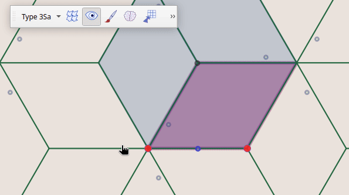

## Cornelis - un plugin QGis pour jouer avec les pavages du plan, en cartographie !

Catégorie : [inutile] en géomatique !

[Maurits Cornelis Escher](https://en.wikipedia.org/wiki/M._C._Escher), cet artiste Hollandais dont vous connaissez évidemment quelques unes de ses gravures (sur bois notamment) avait poussé loin l'exploration des façons de paver le plan avec un motif de base, en étudiant entre autre les mosaïques de L’Alhambra.

Fasciné depuis petit par ces gravures d'une précision incroyable, et motivé par la visite de l'exposition Toulousaine (2025) qui présentait de nombreux originaux, l'idée de faire un outil (couplé à la carto bien sûr !) est naturellement venue.

Cette extension pour QGis vous permettra de créer vos pavages, selon l'un des 35 types et sous-types dont la nomenclature
a été trouvée sur l'excellent site d'Alain Nicolas : [Tessellations](https://fr.tessellations-nicolas.com/methode.php).

L'intégration à QGis permet, après tracé de son pavage, de multiplier les géométries (des couches vectorielles visibles) contenues dans la forme de base. Celles-ci clippées, transformées, dupliquées selon les règles de transformation du motif choisi et remodelé, vont tapisser l'espace pour créer alors une carte potentiellement 'infinie'.


## Dessiner son pavage


**Choisir un pavage de base**

Du plus simple carré de base, répété par simple translation au motif composé de plusieurs tuiles à l'agencement plus complexe, vous disposez de 35 modèles que vous pouvez déplacer, redimensionner et dont vous pouvez déformer les frontières.


Utilisez   pour initier le pavage.

**Déformer le motif**

Les poignées rouges correspondent aux "points de contrôles" du motif, et permettent d'appliquer une transformation sur l'ensemble : rotation, cisaillement, étirement, ou de déplacer un noeud particulier.

Les poignées bleues permettent de déformer les segments 'initiaux', les autres sont des images par translation, rotation, symétrie... et déformés en conséquence.

L'utilisation combinée de la touche [Ctrl] et de la souris supprime un noeud.


**S'aider de l'outil 'croquis'** 

 : Cet outil peut servir à dessiner une esquisse qui sera bien sûr multipliée (une couche en sera produite à la fin), mais il est aussi utile pour comprendre comment les transformations agencent les frontières, pour placer des repères et anticiper sur le positionnement des géométries lors de la construction finale.

Ce croquis est déformé par les opérations de rotation, redimensionnement du motif.



**S'aider d'une sélection**

## Construire la carte

 : Lance la construction de la carte pavée.

Utilise les géométries des couches vectorielles visibles qui intersectent le motif de base (coloré).

Elles sont alors transformées pour couvrir la zone visible et paver le plan.

**Les couches produites**

- Autant de copies que de couches vectorielles affichées.

- Une couche contenant la tuile de base

- Une couche contenant le motif de base (si plusieurs tuiles le composent)

- Une couche correspondant au pavage


## Utiliser l'expression 'cornelis' dans un générateur de géométrie

Avec le type de symbole 'générateur de géométrie', tout est permis ! La fonction "cornelis" s'appuyant sur le pavage courant va transformer les entités à la volée.

Usage :
```python
cornelis($geometry)
```

Ou si la couche n'était pas stockée dans la même projection que celle de la carte, une double transformation peut être nécessaire.

```python
# ou 4326 est la projection de la couche et 2154 celle de la carte
transform(
	cornelis(transform($geometry, 'EPSG:4326', 'EPSG:2154')),
	'EPSG:2154','EPSG:4326'
)
```

Cet usage peut être utile si besoin d'édition des géométries, pour affiner par exemple les raccords aux frontières.

Attention : un petit défaut oblige à déplacer la carte pour déclencher le rafraîchissement.


## Sauver, charger un pavage

 : sauve le pavage ainsi que  le croquis si il existe.

 : Restaure un pavage précédemment sauvegardé.

 : Affiche ou masque le pavage
